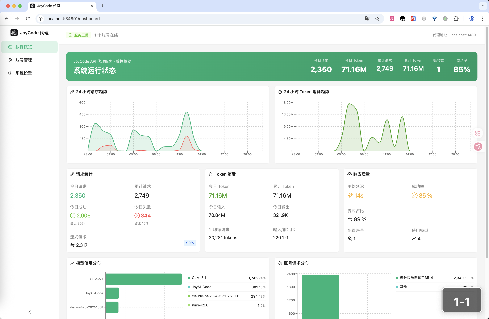
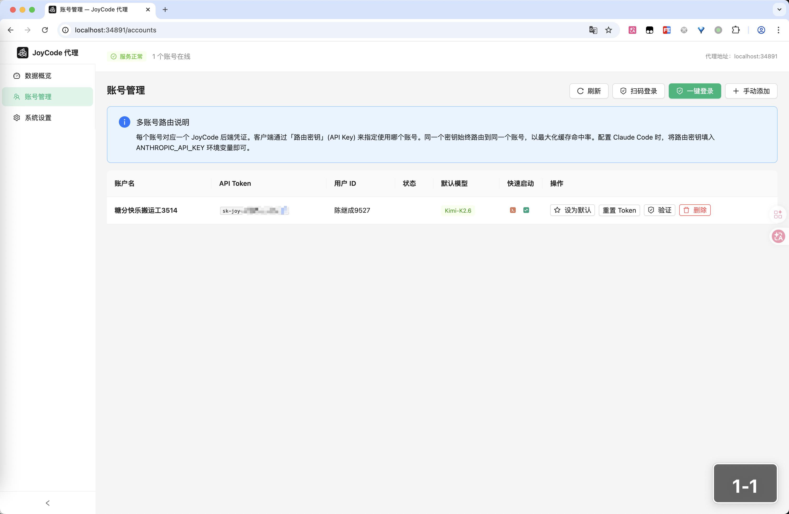
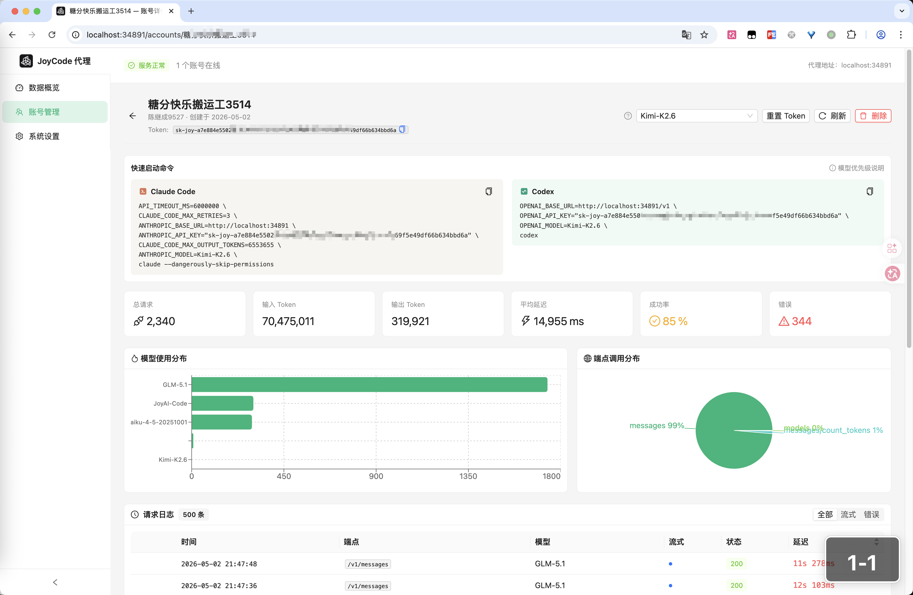
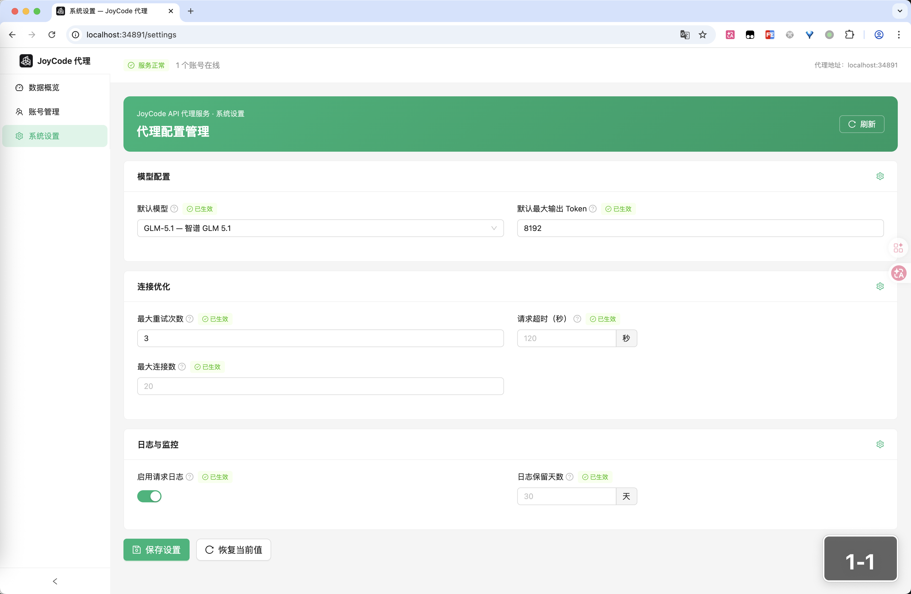

<div align="center">

# JoyCodeProxy

**让 Claude Code、Cursor 直接用 JoyCode 的模型**

JoyAI-Code · GLM-5.1 · Kimi-K2.6 · MiniMax-M2.7 · Doubao-Seed-2.0-pro

[](https://go.dev/)
[](https://react.dev/)
[](./LICENSE)

</div>

---

说白了就一件事：JoyCode（京东的 AI 编程助手）有一堆不错的模型，但协议跟 Anthropic / OpenAI 不一样，Claude Code 这些工具接不上。JoyCodeProxy 就是在中间做个翻译，改两个环境变量就能用了。

```
Claude Code / Cursor / Windsurf  →  JoyCodeProxy  →  JoyCode API
                                    (协议翻译)
```

## 长什么样

自带一个管理界面，账号、用量、配置都在上面搞。

<div align="center">

<p><sub>数据概览 — 请求量、Token 消耗、延迟、模型分布</sub></p>
</div>

<div align="center">

<p><sub>账号管理 — 支持多个 JD 账号，扫码添加</sub></p>
</div>

<div align="center">

<p><sub>账号详情 — 单个账号的用量、模型分布、请求记录</sub></p>
</div>

<div align="center">

<p><sub>系统设置 — 默认模型、超时、日志保留，改完马上生效</sub></p>
</div>

## 能干什么

- **双协议都能接** — Anthropic Messages API 和 OpenAI Chat Completions API 都支持，Claude Code 和 Cursor 各走各的
- **Tool Use 正常工作** — Claude Code 的工具调用（读写文件、跑命令那些）完整翻译，不影响正常使用
- **流式输出** — SSE 流式，打字机效果，实时出结果
- **模型随便选** — JoyAI-Code、GLM-5.1、GLM-5、GLM-4.7、Kimi-K2.6、Kimi-K2.5、MiniMax-M2.7、Doubao-Seed-2.0-pro 都能用
- **多账号** — Dashboard 上扫码加多个 JD 账号，每个账号有自己的 API Key
- **智能截断** — 对话聊太长了会自动截断早期消息，不会卡死，`/compact` 也能正常工作
- **单文件部署** — 前端打包进 Go 二进制，丢一个文件上去就能跑，Docker 也行

## 怎么用

### 先构建

需要 Go 1.22+ 和 Node.js 18+。

```bash
# 先构建前端
cd web && npm install && npm run build && cd ..

# 再构建后端（前端会自动嵌进去）
go build -o joycode_proxy_bin ./cmd/JoyCodeProxy/
```

不想装环境的话，Docker 也行：

```bash
docker build -t joycode-proxy .
docker run -p 34891:34891 joycode-proxy
```

### 跑起来

```bash
./joycode_proxy_bin serve
```

默认监听 `0.0.0.0:34891`。macOS 第一次启动会自动从本地 JoyCode 客户端读凭据，不用手动配。

### 接到 Claude Code

就改两个环境变量：

```bash
export ANTHROPIC_BASE_URL=http://localhost:34891
export ANTHROPIC_API_KEY=joycode

claude
```

完事，直接用。

### 多账号

打开 `http://localhost:34891`，用 JD App 扫码加账号。每个账号会生成一个独立的 API Key：

```bash
export ANTHROPIC_API_KEY=sk-joy-xxxx
claude
```

## API 端点

| 路径 | 干嘛的 |
|------|--------|
| `POST /v1/messages` | Anthropic Messages API，Claude Code 走这个 |
| `POST /v1/chat/completions` | OpenAI Chat Completions API，Cursor 走这个 |
| `POST /v1/web-search` | 网页搜索 |
| `POST /v1/rerank` | 文档重排序 |
| `GET /v1/models` | 拉可用模型列表 |
| `GET /health` | 健康检查 |
| `GET /` | Dashboard 管理界面 |

## 项目结构

```
cmd/JoyCodeProxy/    入口，HTTP 服务器
pkg/anthropic/       Anthropic 协议翻译（请求、响应、SSE 流式）
pkg/openai/          OpenAI 协议翻译
pkg/joycode/         JoyCode API 客户端
pkg/auth/            凭据读取、JD 扫码登录
pkg/store/           SQLite（账号、设置、请求日志）
pkg/dashboard/       Dashboard API
web/                 前端（React + Ant Design）
```

## 许可证

MIT
